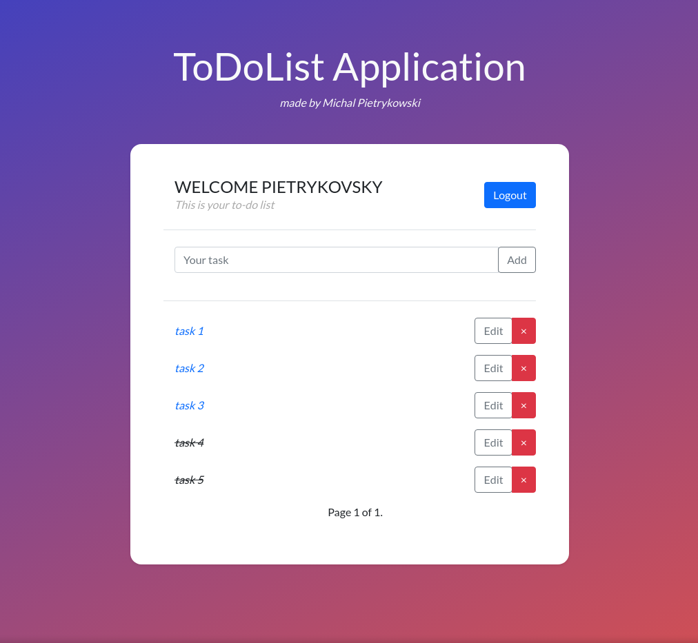

# Preview
  django-todolist is a simple todo app built with Django.
  
  
## Features
* task CRUD functionality
* user authentication system
* template-based interface styled with bootstrap

## Setup
To get this repository, run the following command inside your terminal:
```
git clone https://github.com/pietrykovsky/django-todolist.git
```

Create and start a a virtual environment:
```
python -m venv env
```
```
source env/bin/activate      # On Windows use `env\Scripts\activate`
```
Install the project dependencies:
```
pip install -r requirements.txt
```
This will create all the migrations file (database migrations) required to run this project:
```
python manage.py makemigrations
```
Now, to apply this migrations run the following command:
```
python manage.py migrate
```
Now we need to create admin user:
```
python manage.py createsuperuser
```
And finnaly we can run our local server:
```
python manage.py runserver
```
Once the server is hosted, head over to http://127.0.0.1:8000/
